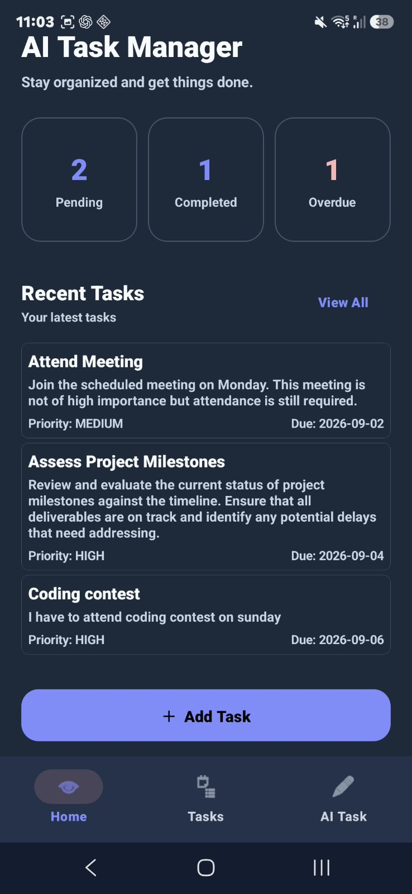
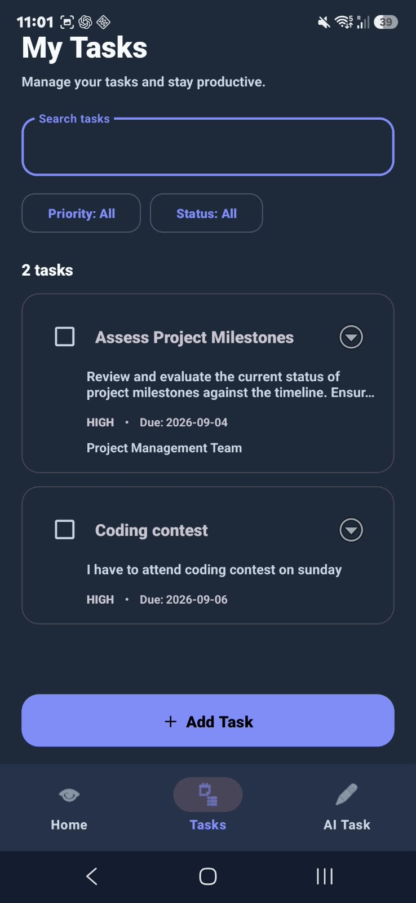
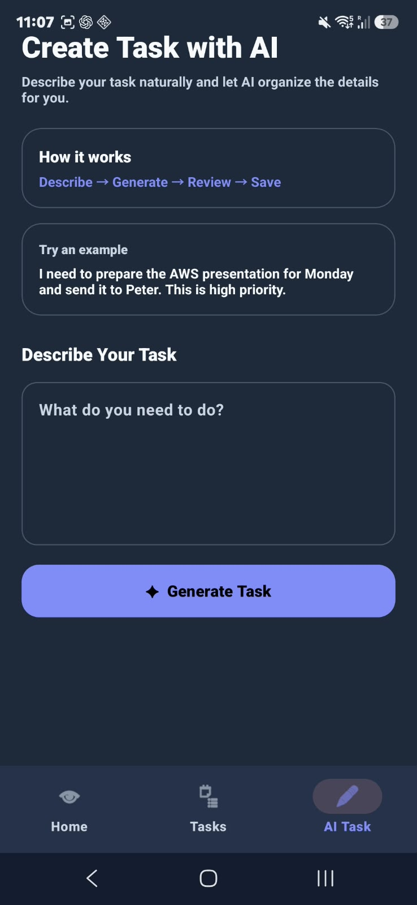
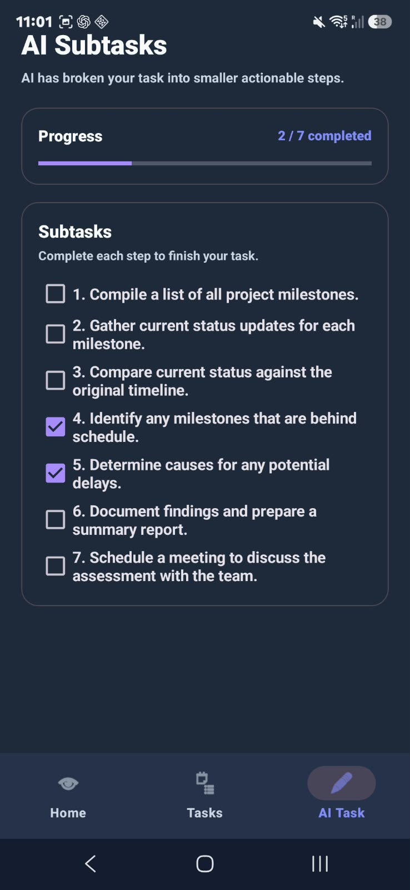
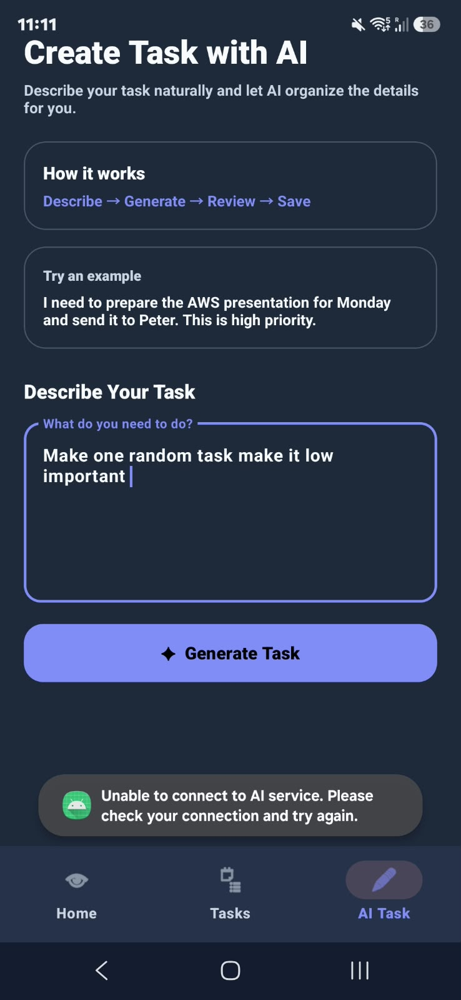

# AI-Powered Task Manager

An Android task management application that combines traditional task management with AI-powered task creation and task breakdown.

Users can create and manage tasks manually or describe a task naturally using AI. The AI converts the natural-language description into structured task information such as title, description, due date, priority, and additional information.

The application can also break complex tasks into smaller actionable subtasks and track their completion progress.

---

## Problem Statement

Traditional task management applications require users to manually enter multiple details such as task title, description, due date, priority, and additional information.

This can make task creation time-consuming, especially when the user has a complex task that needs to be organized into multiple steps.

The AI-Powered Task Manager solves this problem by allowing users to describe a task naturally. The application uses AI to convert the natural-language description into a structured task containing the title, description, due date, priority, and additional information.

The application can also use AI to break a complex task into smaller actionable subtasks.

The goal is to build a simple, practical mobile task manager that combines local data persistence, complete CRUD functionality, and useful AI assistance.

---

## Technology Stack

### Android Application

- Java
- Android Studio
- Material Design
- RecyclerView
- Room Database
- SQLite
- Retrofit
- Gson
- SharedPreferences

### Backend

- Node.js
- Express.js
- REST API
- CORS
- dotenv
- Nodemon

### AI

- **AI Provider:** OpenRouter
- **Model:** `openai/gpt-4o-mini`
- AI communication is handled through the Node.js/Express backend.
- The OpenRouter API key is stored only on the backend using environment variables.

---

## Database

The application uses **Room Database**, which is an abstraction layer over SQLite for Android.

The `Task` entity stores:

- ID
- Title
- Description
- Due Date
- Priority
- Status
- Additional Information
- Created At
- Updated At

Task operations follow this flow:

```text
UI
 ↓
TaskRepository
 ↓
TaskDao
 ↓
Room Database
 ↓
SQLite
```

Normal task management is performed locally and does not require the AI backend.

---

## Features Implemented

### Dashboard

- Pending task count
- Completed task count
- Overdue task count
- Recent tasks
- Empty state
- Quick access to task creation
- Quick access to AI task creation

### Task Management

- Create task
- View tasks
- Edit task
- Delete task
- Complete task
- Reopen completed task

### Task Fields

Each task contains:

- Title
- Description
- Due Date
- Priority
- Additional Information
- Status

Supported priorities:

```text
LOW
MEDIUM
HIGH
```

Supported statuses:

```text
PENDING
COMPLETED
```

### Search and Filtering

- Search tasks by title
- Filter tasks by priority
- Filter tasks by status

### AI Features

- Create task using natural language
- AI-generated task title
- AI-generated description
- AI-generated due date
- AI-generated priority
- AI-generated additional information
- Review and edit AI-generated task before saving
- Regenerate AI result
- Break a task into AI-generated subtasks

### Subtask Management

- Generate subtasks using AI
- Display generated subtasks
- Check/uncheck subtasks
- Track completion progress
- Persist subtask progress locally
- Restore subtask progress when reopening a task

### Error Handling

- Empty input validation
- Empty title validation
- Empty due date validation
- Missing task validation
- Network failure handling
- Backend unavailable handling
- HTTP error handling
- Invalid AI response handling
- Empty AI response handling

---

## AI Approach

The application uses **OpenRouter** as the AI provider with the `openai/gpt-4o-mini` model.

The Android application communicates with a Node.js/Express backend using Retrofit.

The OpenRouter API key is stored only on the backend using an environment variable and is never included in the Android application.

### AI Task Creation

The user enters a task description in natural language.

Example:

> I need to prepare the AWS presentation for Monday and send it to Peter. This is high priority.

The request follows this flow:

```text
User
 ↓
Android AI Task Screen
 ↓
Retrofit
 ↓
Node.js / Express Backend
 ↓
OpenRouter API
 ↓
AI Model
 ↓
Structured JSON
 ↓
Node.js Backend
 ↓
Android Application
 ↓
Review and Edit
 ↓
Room Database
```

The AI extracts the following information:

- Title
- Description
- Due Date
- Priority
- Additional Information

The generated task is displayed to the user for review.

The user can modify the generated information before saving it to the local database.

### Example AI Output

```json
{
  "success": true,
  "task": {
    "title": "Prepare AWS Presentation",
    "description": "Create and finalize the AWS presentation and send it to Peter.",
    "dueDate": "2026-09-07",
    "priority": "HIGH",
    "additionalInfo": "Recipient: Peter"
  }
}
```

### AI Task Breakdown

The application can also break an existing task into smaller actionable subtasks.

The flow is:

```text
Existing Task
 ↓
Android Application
 ↓
Retrofit
 ↓
Node.js / Express Backend
 ↓
OpenRouter AI
 ↓
Generated Subtasks
 ↓
Android Application
 ↓
Checkboxes and Progress Tracking
 ↓
SharedPreferences
```

The backend requests 3–7 practical and actionable subtasks from the AI.

Example:

```text
Main Task:
Prepare AWS Presentation

Subtasks:

1. Collect presentation requirements
2. Create the presentation structure
3. Prepare AWS content
4. Create the presentation slides
5. Review and finalize the presentation
6. Send the presentation to Peter
```

Users can check or uncheck individual subtasks and track the overall completion progress.

---

## Architecture

The Android application follows a layered structure to separate UI, data, business logic, and network communication.

### Android Structure

```text
com.example.ai_task_manager
│
├── database
│   ├── AppDatabase.java
│   └── TaskDao.java
│
├── model
│   └── Task.java
│
├── network
│   ├── AiApiService.java
│   ├── AiTaskRequest.java
│   ├── AiTaskResponse.java
│   ├── SubtaskRequest.java
│   ├── SubtaskResponse.java
│   └── RetrofitClient.java
│
├── repository
│   └── TaskRepository.java
│
├── ui
│   ├── ai
│   │   ├── AiTaskActivity.java
│   │   └── SubtaskActivity.java
│   │
│   ├── dashboard
│   │
│   └── task
│       ├── AddTaskActivity.java
│       ├── EditTaskActivity.java
│       └── TaskListActivity.java
│
└── MainActivity.java
```

### Backend Structure

```text
server
│
├── src
│   ├── controllers
│   ├── routes
│   ├── services
│   ├── middleware
│   └── validators
│
├── .env
├── .gitignore
├── package.json
└── server.js
```

The separation makes the application easier to maintain and allows the AI service to remain independent from the Android application.

---

## Application Flow

### Normal Task Management

```text
User
 ↓
Android UI
 ↓
TaskRepository
 ↓
TaskDao
 ↓
Room Database
 ↓
Dashboard / Task List
```

Tasks are stored locally on the Android device.

### AI Task Creation

```text
User
 ↓
Android App
 ↓
Retrofit
 ↓
Express Backend
 ↓
OpenRouter
 ↓
Structured JSON
 ↓
Android App
 ↓
Review/Edit
 ↓
Room Database
```

### AI Subtask Generation

```text
Existing Task
 ↓
Android App
 ↓
Retrofit
 ↓
Express Backend
 ↓
OpenRouter
 ↓
Subtask JSON
 ↓
Android App
 ↓
Checkboxes
 ↓
Progress Tracking
```

---

## Project Structure

The overall project is organized as follows:

```text
AiTaskManager/
│
├── app/
│   └── src/
│       └── main/
│           ├── java/
│           │   └── com/example/ai_task_manager/
│           │
│           └── res/
│               ├── layout/
│               ├── menu/
│               └── values/
│
├── server/
│   ├── src/
│   │   ├── controllers/
│   │   ├── middleware/
│   │   ├── routes/
│   │   ├── services/
│   │   └── validators/
│   │
│   ├── .env
│   ├── .gitignore
│   ├── package.json
│   └── server.js
│
├── screenshots/
│
└── README.md
```

---

## Backend API

The application provides two AI endpoints.

### Create Task Using AI

**Endpoint:**

```http
POST /api/ai/create-task
```

**Local URL:**

```text
http://localhost:3000/api/ai/create-task
```

**Request Body:**

```json
{
  "input": "I need to prepare the AWS presentation for Monday and send it to Peter. This is high priority."
}
```

**Response:**

```json
{
  "success": true,
  "task": {
    "title": "Prepare AWS Presentation",
    "description": "Create and finalize the AWS presentation and send it to Peter.",
    "dueDate": "2026-09-07",
    "priority": "HIGH",
    "additionalInfo": "Recipient: Peter"
  }
}
```

### Generate Subtasks

**Endpoint:**

```http
POST /api/ai/create-subtasks
```

**Local URL:**

```text
http://localhost:3000/api/ai/create-subtasks
```

**Request Body:**

```json
{
  "title": "Prepare AWS Presentation",
  "description": "Create and finalize the AWS presentation and send it to Peter."
}
```

**Response:**

```json
{
  "success": true,
  "subtasks": [
    {
      "title": "Collect presentation requirements"
    },
    {
      "title": "Create the presentation structure"
    },
    {
      "title": "Prepare AWS content"
    },
    {
      "title": "Review and finalize the presentation"
    },
    {
      "title": "Send the presentation to Peter"
    }
  ]
}
```

---

## Backend Setup

### Requirements

Install the following:

- Node.js
- npm

Verify the installation:

```bash
node --version
npm --version
```

### Step 1: Navigate to the Backend

From the project root:

```bash
cd server
```

### Step 2: Install Dependencies

```bash
npm install
```

### Step 3: Configure Environment Variables

Create a file:

```text
server/.env
```

Add:

```env
PORT=3000
OPENROUTER_API_KEY=YOUR_OPENROUTER_API_KEY
```

Replace `YOUR_OPENROUTER_API_KEY` with your own OpenRouter API key.

### Step 4: Start the Backend

For normal execution:

```bash
npm start
```

For development:

```bash
npm run dev
```

The backend runs on:

```text
http://localhost:3000
```

---

## Android Setup

### Requirements

- Android Studio
- Android SDK
- Java 11
- Android Emulator or Android device
- Node.js and npm for AI functionality

### Step 1: Open the Project

Open the `AiTaskManager` project in Android Studio.

### Step 2: Sync Gradle

Allow Android Studio to download and configure the required dependencies.

### Step 3: Start the Backend

Open a terminal:

```bash
cd server
npm install
npm start
```

### Step 4: Run the Android Application

Start an Android Emulator and run the application from Android Studio.

---

## Android to Local Backend Connection

When using the Android Emulator, `localhost` refers to the emulator itself rather than the host computer.

Therefore, the application uses:

```text
http://10.0.2.2:3000/
```

instead of:

```text
http://localhost:3000/
```

`10.0.2.2` allows the Android Emulator to access the host computer's localhost.

The backend URL is configured in:

```text
RetrofitClient.java
```

---

## AI Features Requirements

The Node.js backend must be running for:

- AI Task Creation
- AI Task Breakdown

Normal task management does not require the backend because tasks are stored locally using Room Database.

AI functionality requires:

- Running Node.js backend
- Internet connectivity
- Valid OpenRouter API key

---

## Validation and Error Handling

The application handles invalid input, network failures, backend errors, and invalid AI responses gracefully.

### Input Validation

The application validates:

- Empty task title
- Empty due date
- Empty AI input
- Missing task ID
- Missing task information

### AI Error Handling

The application handles:

- Backend unavailable
- Network connection failure
- HTTP errors
- Empty API responses
- Invalid AI responses
- AI service errors
- Empty generated subtasks

### Backend Unavailable

If the Node.js backend is stopped while using an AI feature, the application does not crash.

Instead, the user sees:

> Unable to connect to AI service. Please check your connection and try again.

Technical exception details are logged for debugging and are not directly displayed to the user.

---

## Security

The OpenRouter API key is stored only on the Node.js backend.

It is loaded through an environment variable:

```env
OPENROUTER_API_KEY=YOUR_OPENROUTER_API_KEY
```

The API key is not stored inside the Android application.

The real `.env` file should not be committed to Git.

The backend `.gitignore` should contain:

```gitignore
node_modules/
.env
```

For sharing the project, create:

```text
server/.env.example
```

with:

```env
PORT=3000
OPENROUTER_API_KEY=YOUR_OPENROUTER_API_KEY
```

---

## Subtask Persistence

AI-generated subtasks and their completion states are stored locally using SharedPreferences.

Each task uses its unique Room Database task ID.

For example:

```text
Task ID: 1
Preference Key: task_1
```

Another task:

```text
Task ID: 2
Preference Key: task_2
```

This ensures that subtasks belonging to different tasks remain separate.

Subtask progress can be restored when the user leaves and reopens the subtask screen.

---

## Screenshots

The project includes 2–5 screenshots as required for submission.

Recommended screenshots:

```text
screenshots/
├── 01-dashboard.png
├── 02-task-list.png
├── 03-ai-task.png
├── 04-ai-subtasks.png
└── 05-error-handling.png
```

### Dashboard

Shows:

- Pending tasks
- Completed tasks
- Overdue tasks
- Recent tasks
- Quick actions



### Task List

Shows:

- Search
- Priority filter
- Status filter
- Tasks
- Completion controls



### AI Task Creation

Shows:

- Natural-language input
- AI-generated task information
- Review and edit functionality



### AI Subtasks

Shows:

- Main task
- AI-generated subtasks
- Checkbox completion
- Progress tracking



### Error Handling

Shows the friendly error message when the backend is unavailable.



---

## Known Limitations

- Tasks are currently stored locally on the device.
- There is no user authentication.
- Tasks are not synchronized across multiple devices.
- AI features require the Node.js backend and internet connectivity.
- The development environment uses a local HTTP backend.
- Production deployment would require HTTPS.
- Subtasks are currently stored using SharedPreferences instead of a separate Room entity.
- Push notifications and task reminders are not implemented.
- There is no cloud synchronization.

---

## Future Improvements

Possible future improvements include:

- User authentication
- Cloud task synchronization
- Push notifications
- Task reminders
- Calendar integration
- Recurring tasks
- Persistent subtasks using Room Database
- Production HTTPS backend
- Cloud deployment
- AI-generated productivity suggestions
- AI-based task prioritization
- Task analytics and productivity reports

---

## Testing Checklist

### Dashboard

- [x] Pending count
- [x] Completed count
- [x] Overdue count
- [x] Recent tasks
- [x] Empty state

### Task Management

- [x] Create task
- [x] View task
- [x] Edit task
- [x] Delete task
- [x] Complete task
- [x] Reopen task
- [x] Search tasks
- [x] Filter by priority
- [x] Filter by status
- [x] Local database persistence

### AI Task Creation

- [x] Natural-language input
- [x] AI-generated title
- [x] AI-generated description
- [x] AI-generated due date
- [x] AI-generated priority
- [x] AI-generated additional information
- [x] Review AI result
- [x] Edit AI result
- [x] Save AI-generated task
- [x] Regenerate AI result

### AI Subtasks

- [x] Generate subtasks
- [x] Display subtasks
- [x] Check subtask
- [x] Uncheck subtask
- [x] Update progress
- [x] Persist subtask progress
- [x] Restore subtask progress

### Error Handling

- [x] Empty AI input
- [x] Empty task title
- [x] Empty due date
- [x] Missing task ID
- [x] Missing task information
- [x] Backend unavailable
- [x] Network failure
- [x] HTTP error
- [x] Empty API response
- [x] Invalid AI response
- [x] Empty AI-generated subtasks
- [x] Application does not crash on network failure

---

## Local and Online Behavior

### Features That Work Locally

The following features use the local Room Database:

- View tasks
- Create tasks
- Edit tasks
- Delete tasks
- Complete tasks
- Reopen tasks
- Search tasks
- Filter tasks
- Dashboard
- Previously generated subtasks
- Subtask completion tracking

### Features That Require the Backend

The following features require the Node.js backend and internet:

- AI Task Creation
- AI Task Breakdown

---

## API Testing with Postman

The backend APIs can be tested independently using Postman.

### Create Task

Method:

```text
POST
```

URL:

```text
http://localhost:3000/api/ai/create-task
```

Body:

```json
{
  "input": "I need to prepare the AWS presentation for Monday and send it to Peter. This is high priority."
}
```

Select:

```text
Body → raw → JSON
```

### Generate Subtasks

Method:

```text
POST
```

URL:

```text
http://localhost:3000/api/ai/create-subtasks
```

Body:

```json
{
  "title": "Prepare AWS Presentation",
  "description": "Create and finalize the AWS presentation and send it to Peter."
}
```

---

## Build and APK

The Android application can be built using Android Studio.

To generate an APK:

```text
Build
 ↓
Generate App Bundles or APKs
 ↓
Generate APKs
```

The debug APK is normally generated under:

```text
app/build/outputs/apk/debug/
```

For final submission, a signed release APK can be generated if required.

---

## Final Submission Structure

The final submission can contain:

```text
AiTaskManager/
│
├── app/
├── gradle/
├── build.gradle
├── settings.gradle
├── gradlew
├── gradlew.bat
│
├── server/
│   ├── src/
│   ├── package.json
│   ├── package-lock.json
│   ├── server.js
│   ├── .gitignore
│   └── .env.example
│
├── screenshots/
│   ├── 01-dashboard.png
│   ├── 02-task-list.png
│   ├── 03-ai-task.png
│   ├── 04-ai-subtasks.png
│   └── 05-error-handling.png
│
├── APK/
│   └── AiTaskManager.apk
│
└── README.md
```

The real `server/.env` file containing the API key should not be included in the repository or ZIP submission.

---

## Final Demonstration

The final demonstration should cover the main requirements of the application.

### 1. Main Application Flow

Demonstrate:

```text
Dashboard
 ↓
Create Task
 ↓
Task List
 ↓
Edit Task
 ↓
Complete / Reopen
```

### 2. Local Database

Create a task and restart the application.

Show that the task remains available.

Explain:

> Tasks are persisted locally using Room Database, so normal task management does not depend on the AI backend.

### 3. CRUD Operations

Demonstrate:

```text
Create
 ↓
Read
 ↓
Update
 ↓
Delete
```

Also demonstrate completing and reopening a task.

### 4. AI Feature

Enter:

```text
I need to prepare the AWS presentation for Monday and send it to Peter. This is high priority.
```

Generate the task and show the structured result.

Explain:

> The Android application sends the natural-language input to the Node.js backend using Retrofit. The backend communicates with OpenRouter and returns structured JSON. The generated task is shown to the user for review and editing before it is saved.

### 5. AI Subtasks

Open an existing task and select:

```text
Break into Subtasks
```

Show the generated subtasks and complete some of them.

Demonstrate the progress indicator.

### 6. Error Handling

Stop the Node.js backend and try to use an AI feature.

Show:

> Unable to connect to AI service. Please check your connection and try again.

Explain:

> Network failures are handled using Retrofit's failure callback. HTTP errors and invalid responses are also handled separately so the application does not crash.


---
